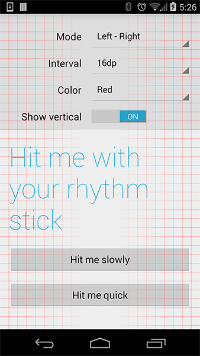

RhythmSticks
============

A debug Android View that overlays a grid to verify that UI elements adhere to a visual rhythm.

Usage
-----

Place a `RhythmFrameLayout` anywhere in your View hierarchy to display a grid over its children. This is typically something you only want in debug builds, and Gradle gives you cool ways of doing that (see example).

`RhythmFrameLayout` can be used much like [Scalpel][1]. Check out Jake Wharton's [u2020][2] example app for ideas on how you could include some *rhythm* in your debug builds.

`RhythmFrameLayout` has four modes:

  * `MODE_LEFT_RIGHT`: Grid is rendered from left and right, fading in the middle
  * `MODE_TOP_BOTTOM`: Grid is rendered from top and bottom, fading in the middle
  * `MODE_TOP_LEFT`: Grid is rendered from top left corner
  * `MODE_BOTTOM_RIGHT`: Grid is rendered from the bottom right corner
  
It's often useful to change these modes at run time, as most Android screens don't divide neatly by 16dp.

License
--------

    Copyright 2014 Christopher Horner

    Licensed under the Apache License, Version 2.0 (the "License");
    you may not use this file except in compliance with the License.
    You may obtain a copy of the License at

       http://www.apache.org/licenses/LICENSE-2.0

    Unless required by applicable law or agreed to in writing, software
    distributed under the License is distributed on an "AS IS" BASIS,
    WITHOUT WARRANTIES OR CONDITIONS OF ANY KIND, either express or implied.
    See the License for the specific language governing permissions and
    limitations under the License.
    
 [1]: https://github.com/JakeWharton/scalpel
 [2]: https://github.com/JakeWharton/u2020